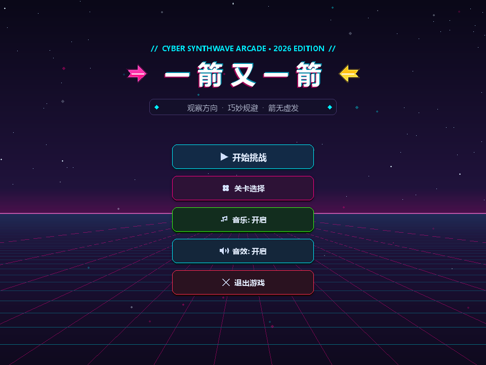
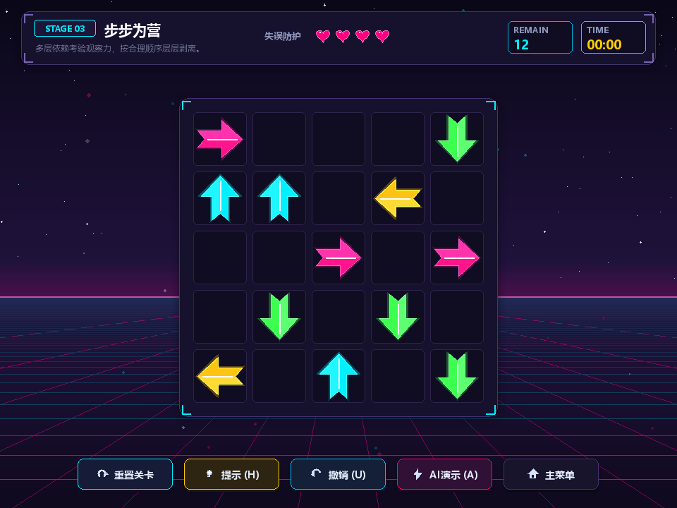
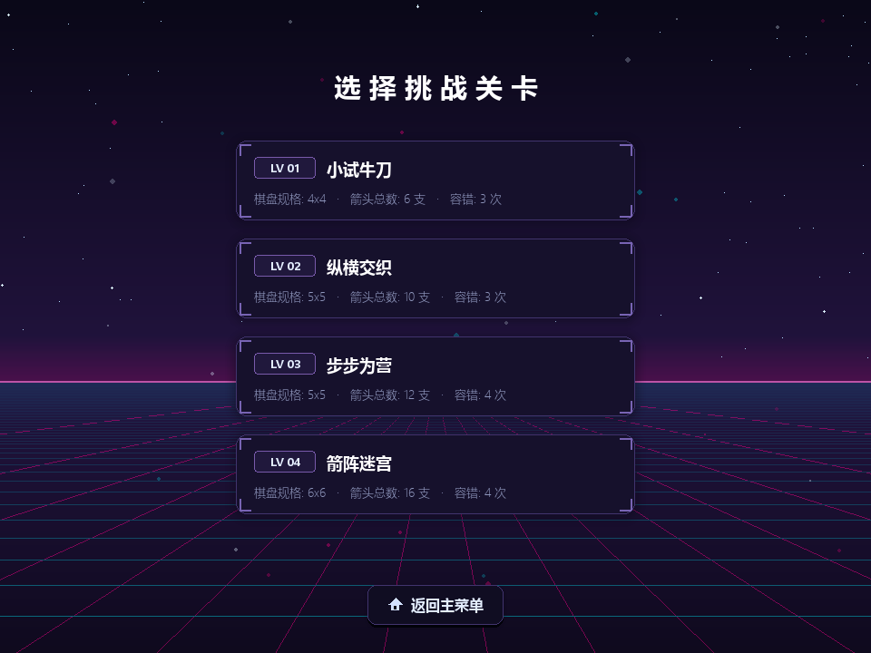
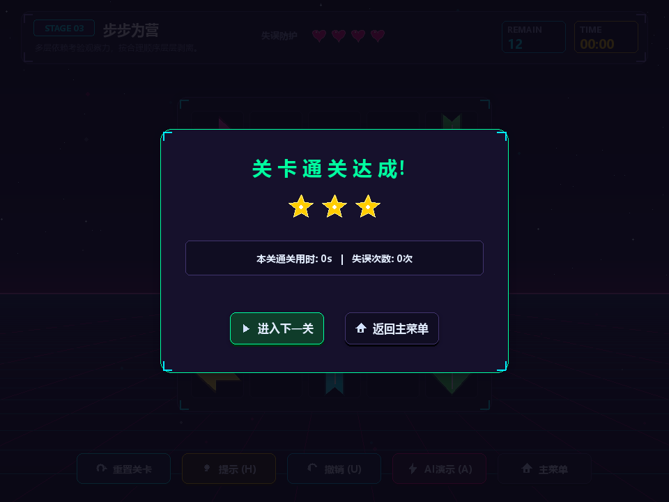

# 《一箭又一箭 - 赛博合成波街机版》 (Arrow by Arrow: Cyber Synthwave Edition)

> 软件工程课程个人项目作业二 —— 基于 **Python + Pygame-ce** 与 **AIGC 协同设计** 打造的一款赛博朋克合成波（Synthwave）街机风空间逻辑解谜消除游戏。

---

## 一、 项目简介

《一箭又一箭》是一款以空间拓扑与路径推演为核心的网格解谜游戏。在网格空间中分布着指向不同正交方向（上、下、左、右）的霓虹光效箭头。玩家需要仔细观察箭头之间的相互阻挡与依赖关系，找出当前路线上畅通无阻的箭头并依次点击发射消除，直至将棋盘中全部箭头清空。

游戏不仅考验玩家的全局观察力与逆向拓扑推理能力，更通过 **80s 赛博合成波透视视效**、**实体物理飞跃撞击动画** 以及 **沉浸式合成器背景音乐**，带来极具打击感与视听张力的街机消除体验。

---

## 二、 核心功能与亮点特性

### 1. 深度空间拓扑消除机制
- **正交四向发射**：支持 **上 (UP)、下 (DOWN)、左 (LEFT)、右 (RIGHT)** 四向射线检测。
- **射线投射路径检测算法 (Raycasting)**：精确判定发射轴线上的阻挡障碍，毫秒级响应。
- **棋盘边缘边界安全防护**：棋盘外沿朝外箭头平滑飞向视口深空，杜绝任何数组越界与崩溃异常。
- **全关卡无死锁求解保障**：基于有向无环图（DAG）拓扑排序求解算法，内置所有关卡 100% 具备合法通关解。

### 2. 真实物理飞跃、撞击反馈与碰撞互斥锁
- **受阻前冲物理飞跃**：当点击受阻箭头时，箭头不会僵硬原地抖动，而是沿其指向**真实飞跃空单元格**直冲阻挡物。
- **撞击瞬间火花与音效**：在箭头尖端精确触碰阻挡箭头边界的瞬间，爆发**高科技金属偏折音效**与**玫瑰红/青色能量火花溅射**。
- **心形扣除精准时机同步**：箭头飞渡途中失误心形保持完好，**仅在真正撞击接触的瞬间精确扣除**；在最后一颗心的致命撞击中，完整播放飞跃、撞击、碎裂、反弹滑回的全套死亡动画，随后优雅呼出结算。
- **碰撞复位互斥锁定保护**：只要棋盘上有箭头处于受阻前冲或反弹滑回原位的过程中，系统自动开启输入锁定，在此期间点击其他任何箭头均判定为无效，彻底杜绝多箭头动画穿模与连点逻辑冲突。

### 3. 80s 赛博合成波（Synthwave）美术与 UI 重构
- **合成波透视网格背景**：深邃星空、洋红霓虹地平线透视网格以及 36 颗随机悬浮微光的空间浮游微粒（Ambient Motes）。
- **实体触感激光拟态箭头**：纯算法全矢量渲染，具备双层柔和高斯外发光、斜向高光反光切面、能量脉冲脊线以及立体按压阴影。
- **纯几何矢量图标系统**：所有按钮图标（开始、关卡、音乐♫、音效、退出、刷新、灯泡提示、撤销、闪电推演）均由纯数学几何路径实时绘制，全平台高分屏自适应，彻底告别字符库方块乱码（□）。
- **独立音乐/音效双控制与排版**：主菜单 5 选项黄金比例均布，支持分别对背景音乐与音效进行独立启闭。

### 4. 沉浸式立体音效与背景音乐系统
- **CC0 赛博合成波背景音乐 (BGM)**：
  - 精选知名开源音乐人 Fupi 创作的 `Synthwave House Loop` (114 BPM，空间合成器 Pad 铺底 + 强劲复古贝斯律动)；
  - 采用 **CC0 1.0 Universal 公共领域全免费授权**，支持无缝循环伴奏与淡入淡出（fade-in/fade-out）。
- **程序化合成 PCM 音效系统**：
  - 基于 Python 标准库 `wave` 与数学波形实时生成，零外部音效文件依赖：
    - **成功飞出音 (Fly)**：400Hz -> 900Hz 快速上扬正弦扫频；
    - **赛博金属碰撞音 (Cyber Deflect)**：580Hz -> 160Hz 快速下潜 FM 调制金属偏振声 + 瞬态火花爆破 + 90Hz 充沛低频抗阻重音；
    - **按钮点击音 (Click)**：880Hz 极短高频清脆点触；
    - **智能提示音 (Hint)**：双音清脆科技铃声 (E6 -> A6)；
    - **通关胜利音 (Victory)**：欢快大三和弦琶音 (C5-E5-G5-C6)；
    - **失败音 (Fail)**：下行悲伤短音 (A4 -> F4 -> D4)。

### 5. 辅助与高分扩展功能 (Bonus Features)
- **全局 M 键随时静音**：在游戏任何界面与游玩阶段，按下键盘 `M` 键随时一键开启/静音背景音乐。
- **智能提示 (Hint, 快捷键 H)**：自动检测当前棋盘上的可消除箭头，以金色呼吸能量光环动态高亮引导。
- **悔棋撤销 (Undo, 快捷键 U)**：支持单步撤销已消除箭头及失误惩罚，回退历史操作。
- **AI 自动求解演示 (Auto Solve, 快捷键 A)**：一键开启 AI 步进推演，动态自动演示通关全流程。
- **关卡选择与星级评价**：内置 4 大梯度关卡，通关后依据失误次数评定 1~3 星成就并记录用时。

---

## 三、 游戏实机截图展示

| 赛博合成波主菜单界面 | 关卡游玩实况 (Stage 03) |
|:---:|:---:|
|  |  |

| 关卡选择界面 | 关卡通关达成结算 |
|:---:|:---:|
|  |  |

---

## 四、 开发与运行环境

| 项目 | 要求与配置 |
|:---|:---|
| **操作系统** | Windows 10 / 11、macOS、Linux |
| **编程语言** | Python 3.8 ~ 3.13+ (推荐 3.10+) |
| **核心游戏引擎** | `pygame-ce` (>= 2.5.0) |
| **音频依赖** | 标准库 `wave` + `pygame.mixer` (支持 OGG / WAV) |

---

## 五、 安装与运行指南

### 1. 克隆代码仓库
```bash
git clone https://github.com/King-Zhi/ArrowByArrow.git
cd ArrowByArrow
```

### 2. 安装项目依赖
推荐在虚拟环境或系统终端中安装：
```bash
pip install -r requirements.txt
```

### 3. 启动游戏
```bash
python main.py
```

### 4. 运行全套自动化测试
```bash
python -m unittest discover -s tests
```
> 目前包含 10 项严苛的单元测试，覆盖核心消除、阻挡失误、边界安全、通关判定、全关卡可解性、碰撞互斥锁及音频管理器 API。

---

## 六、 操作按键说明

| 按键 / 操作 | 作用范围 | 功能说明 |
|:---|:---|:---|
| **鼠标左键** | 全局 | 点击选择箭头发射、点击菜单/交互按钮 |
| **快捷键 M** | **全局** | **一键切换背景音乐（BGM）开启 / 静音** |
| **快捷键 R** | 游戏中 | **重新开始**当前关卡（恢复初始箭阵与生命值） |
| **快捷键 H** | 游戏中 | **智能提示**（金色动态光环高亮一枚可行箭头） |
| **快捷键 U** | 游戏中 | **撤销上一步**（恢复消除箭头与失误次数） |
| **快捷键 A** | 游戏中 | 开启 / 暂停 **AI 自动推演演示** |
| **快捷键 ESC**| 全局 | 返回主菜单 / 关卡选择界面 |

---

## 七、 关卡配置一览

| 关卡编号 | 关卡名称 | 棋盘规格 | 箭头总数 | 最大容错 | 关卡设计特点 |
|:---:|:---|:---:|:---:|:---:|:---|
| **第 1 关** | 初试锋芒 | 4 × 4 | 6 支 | 3 次 | 新手教学关，基础单层阻挡，掌握点击与飞出规律 |
| **第 2 关** | 穿针引线 | 5 × 5 | 9 支 | 4 次 | 引入中心交叉环绕与纵深射击通道 |
| **第 3 关** | 步步为营 | 5 × 5 | 12 支 | 4 次 | 多层正交网状相互咬合，考验逆向剥离思维 |
| **第 4 关** | 终极箭阵 | 6 × 6 | 16 支 | 5 次 | 复杂高密度箭阵，深度长路径依赖，极富挑战性 |

---

## 八、 项目工程架构

```text
ArrowByArrow/
├── assets/                          # 多媒体与美术资产目录
│   ├── audio/                       # 背景音乐与音频资源
│   │   ├── bgm_synthwave.ogg        # CC0 赛博合成波背景音乐 (1.17 MB)
│   │   └── README.md                # 音频版权与来源许可说明
│   ├── images/                      # 图像资产
│   │   └── bg.png                   # 80s 霓虹透视空间背景贴图
│   └── screenshots/                 # 游戏实机高清截图
│       ├── menu.png                 # 赛博主菜单
│       ├── gameplay.png             # 核心游玩关卡
│       ├── level_select.png         # 关卡选择
│       └── level_clear.png          # 通关结算
├── src/                             # 核心源代码
│   ├── core/                        # 游戏核心逻辑模块
│   │   ├── arrow.py                 # 箭头实体类、四向枚举、物理飞跃与碰撞动画插值
│   │   ├── board.py                 # 棋盘网格、射线投射碰撞检测、失误心形与互斥锁机制
│   │   ├── solver.py                # DAG 拓扑求解器、死锁验证、智能提示与 AI 推演
│   │   └── level_manager.py         # 关卡数据管理器与多难度梯度关卡配置
│   ├── audio/                       # 音频系统模块
│   │   └── sound.py                 # 程序化合成音效引擎 (Fly, Deflect, Win等) 与 BGM 控制流
│   ├── ui/                          # 渲染与用户界面模块
│   │   ├── theme.py                 # 调色盘、高清字体适配、矢量图标绘制与触感发光计算
│   │   └── renderer.py              # 主渲染管线、悬浮棋盘、动态粒子系统与全屏模态弹窗
│   └── game_app.py                  # 游戏主应用程序与顶层状态机 (MENU, PLAYING, WIN, OVER等)
├── tests/                           # 单元测试模块
│   └── test_game.py                 # 覆盖 T01~T06 规范用例、死锁验证与互斥锁的自动化测试集
├── main.py                          # 游戏程序入口
├── requirements.txt                 # Python 依赖清单 (pygame-ce)
├── README.md                        # 项目官方使用与说明文档
└── BLOG.md                          # 软件工程个人作业博客发布稿
```

---

## 九、 开源许可与资产致谢

- **代码许可**：本项目代码遵循 MIT License 开源协议。
- **背景音乐**：`Synthwave House Loop` 遵循 **CC0 1.0 Universal** 公共领域协议，感谢作者 [Fupi (OpenGameArt)](https://opengameart.org/content/synthwave-house-loop) 的优秀作品。
- **音效系统**：所有游戏音效均为程序实时数学波形计算生成，完全自主可控。
